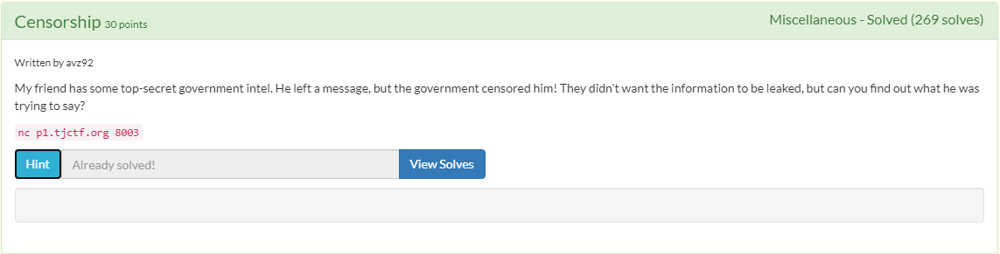
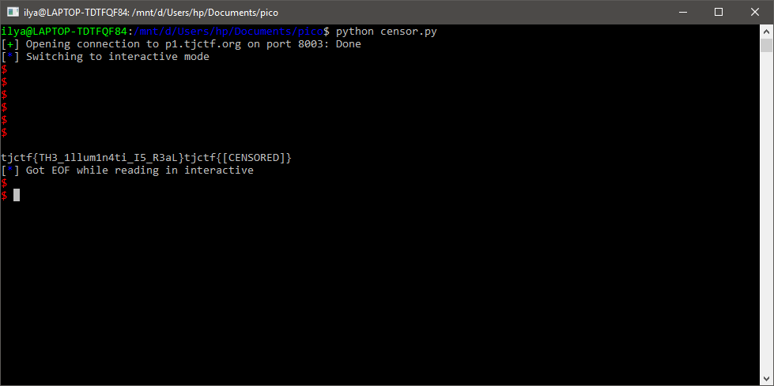

# Censorship
## Description

## Solution
1. Berikut hasil ketika di netcat: Apabila dicoba beberapa kali, dapat disimpulkan bahwa operasi yang dilakukan selalu penjumlahan. Tampaknya flag akan disensor jika masukan input cukup lama (menurut waktu komputer).
2. Menggunakan [sockets](https://docs.pwntools.com/en/stable/tubes/sockets.html) dari [pwntools](https://pypi.org/project/pwntools/) untuk membuka koneksi
3. Dibuat skrip python untuk menginput secara otomatis: 
    ```
    from pwn import * r = remote('p1.tjctf.org', 8003)
    r.recvuntil("what is ")
    a = int(r.recvuntil(" "))
    r.recvuntil(" ")
    b = int(r.recvuntil("?")[:1])
    r.recvuntil("\n")
    r.send(str(a + b))
    r.interactive()
    ```
4. Hasil: 