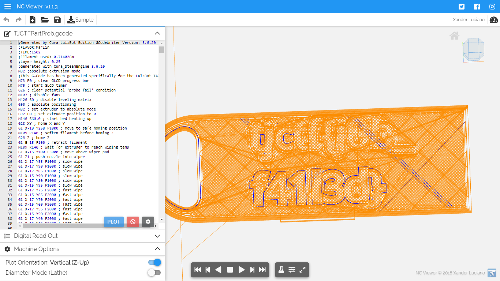

# Slicer
## Description

## Solution
1. Attachment berupa file bernama TJCTFPartProb.gcode
2. menurut [wiki](https://en.wikipedia.org/wiki/G-code), G-code adalah bahasa pemrograman mesin [CNC](https://en.wikipedia.org/wiki/Numerical_control).
3. Menggunakan [online viewer](https://ncviewer.com/), dapat dilihat bahwa file tersebut mencetak gantungan kunci bertuliskan  

4. Ketika di-submit flag tersebut merupakan fake flag.  

5. Ketika dijalankan, pergerakan print head cukup aneh.  

6. Berdasarkan hint, saya rasa flag disembunyikan pada feed rate yang mana merupakan parameter dengan variabel F.
7. ``grep -Eoh '\bF[0-9]+' TJCTFPartProb.gcode | sed 's/F//' | tr -d '.', | awk '{printf "%c", $1}; echo'`` dan benar saja, ketika nilai feed rate diisolasi lalu dijadikan ASCII, flag berhasil didapatkan.  
