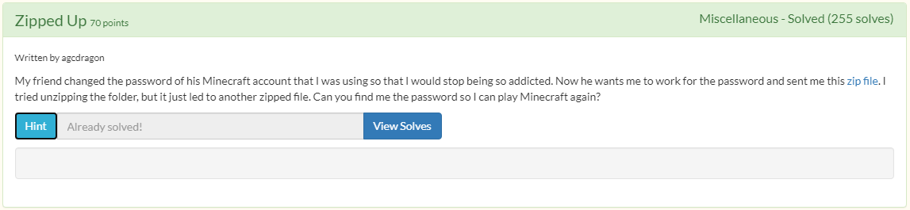
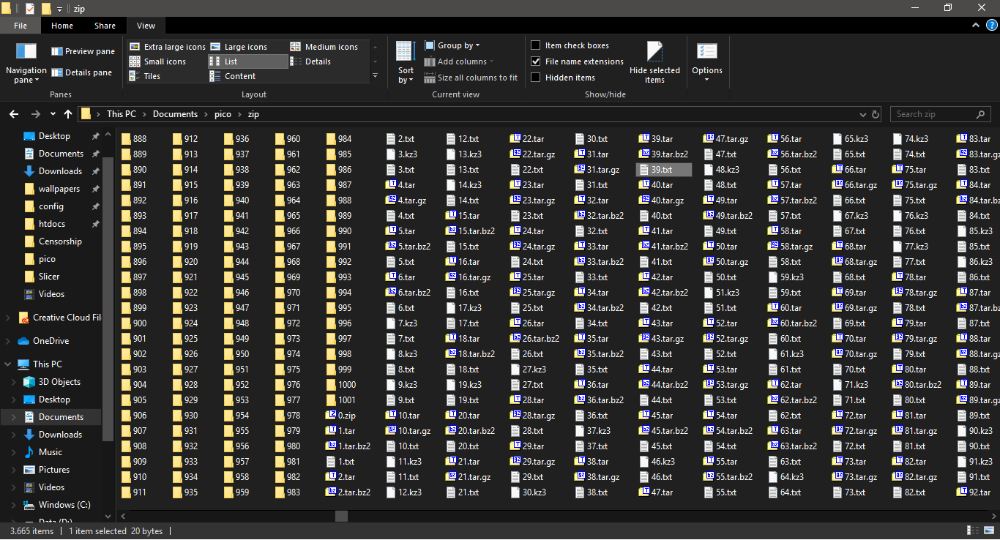
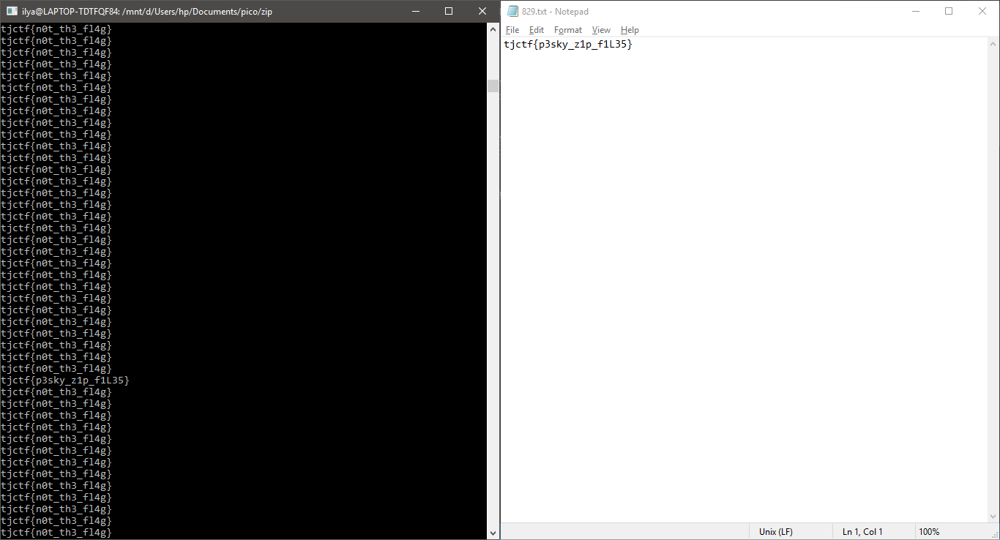

# Zipped Up
## Description

## Solution
1. Attachment berupa archive bernama 0.zip, yang mana merupakan nested-archive.
2. Di dalamnya terdapat beberapa format archive, antara lain: .zip, .tar, .tar.bz2, .tar.gz, .kz3.
3. Digunakan bash dan 7-zip untuk mengekstrak semua isi dari file tersebut.  
``for i in {0..10000}; do find -iname $i.\* -exec 7z e -aos -bse0 {} \;; find -iname $i.\* -exec 7z e -aos -bse0 {} \;; find -iname $i.\* -exec 7z e -aos -bse0 {} \;; done``
4. Hasil ekstrak: 
5. Terdapat 3664 item yang sebagian besar merupakan folder, archive, dan text.
6. Ketika digunakan `cat *.txt` didapatkan flag yang ketika ditelusuri berada di 829.txt  
