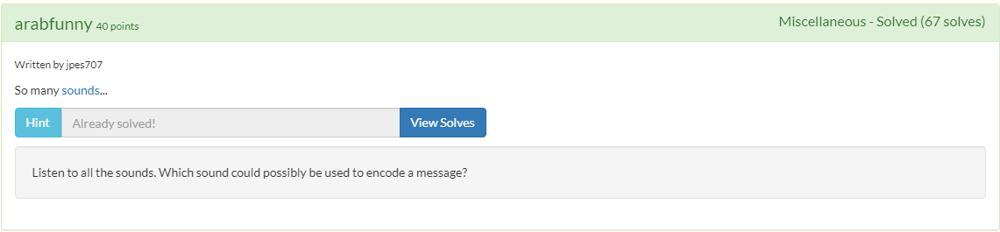
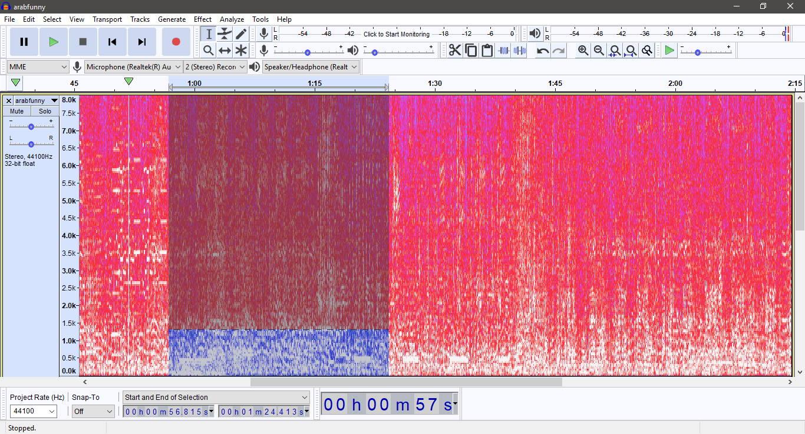
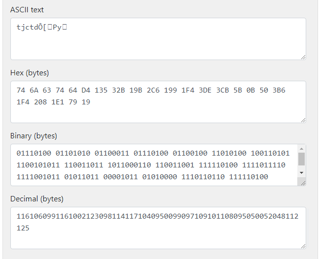
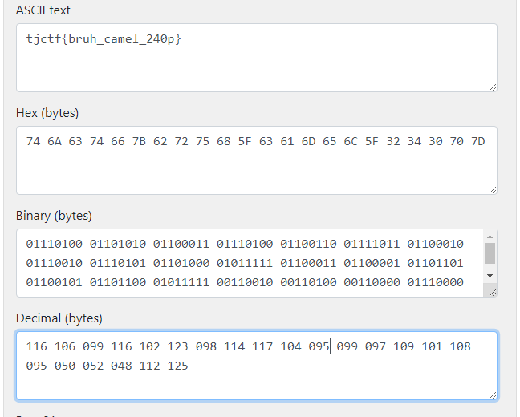

# arabfunny
## Description

## Solution
1. Attachment berupa file audio bernama arabfunny.mp3
2. Setelah diperdengarkan dengan seksama, ada banyak suara yang terdengar.
3. Pertanyaannya, suara manakah yang dapat meng-encode suatu pesan?
4. Setelah file dibuka di [Audacity](https://www.audacityteam.org/) dan dilihat dengan spectrogram, terlihat balok-balok yang tersusun secara teratur.  
5. Ketika dimainkan, ada bunyi dial-tones pada sekitar menit pertama.
6. Setelah diterjemahkan secara manual menggunakan bantuan [tools online](http://onlinetonegenerator.com/dtmf.html), menghasilkan angka `11610609911610021230981141171040950099097109101108095050052048112125`
7. Angka tersebut terlihat seperti ASCII. Menggunakan [konverter online](https://www.rapidtables.com/convert/number/ascii-hex-bin-dec-converter.html) didapatkan hasil:  
8. Hasil terjemahan rupanya tampak salah namun bentuk flag sudah terlihat. Setelah dikoreksi, flag berhasil didapatkan.  